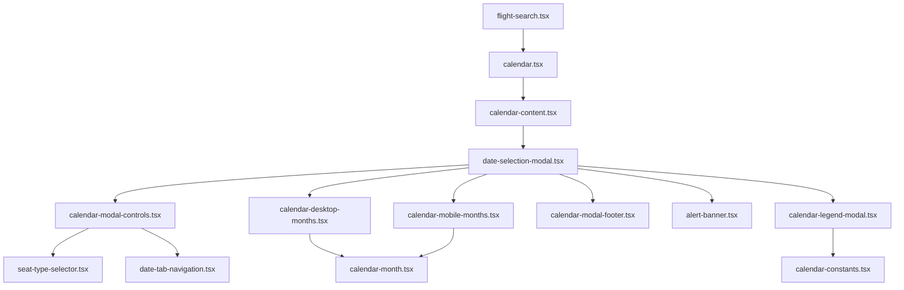

# Calendar Feature Flow

This document describes the current implementation of the calendar feature in apps/top-app/components/flight-search/calendar.

The feature is organized into three layers:

1. calendar.tsx: Trigger component in the flight search form.
2. calendar-content.tsx: Data connector to Redux and fare-fetch orchestration.
3. date-selection-modal.tsx: Modal container that composes focused UI subcomponents.

## Current File Map

- calendar.tsx
- calendar-content.tsx
- date-selection-modal.tsx
- calendar-modal-controls.tsx
- calendar-desktop-months.tsx
- calendar-mobile-months.tsx
- calendar-modal-footer.tsx
- alert-banner.tsx
- calendar-month.tsx
- seat-type-selector.tsx
- date-tab-navigation.tsx
- calendar-legend-modal.tsx
- calendar-constants.tsx
- mock-data.ts

## File Flow



## Data Flow

```mermaid
flowchart TD
    A[calendar.tsx open=true] --> B[calendar-content.tsx]
    B --> C[fetchCalendarFares thunk]
    C --> D[/[locale]/api/search/calendar-fares]
    D --> E[calendar-fares.service.ts]
    E --> F[SDK SearchApi.searchCalendarFaresGet]
    F --> G[calendar-fares.slice.ts]
    G --> H[outboundFares + inboundFares + loadedRanges]
    H --> B
    B --> I[outboundPrices/inboundPrices + promo prices]
    I --> J[date-selection-modal.tsx]
    J --> K[calendar-month.tsx cell rendering]
```

## Component Responsibilities

### calendar.tsx

- Renders the clickable calendar field in flight search.
- Controls open state for the modal.
- Converts selected Date objects back into form values.
- Passes trip mode and route details into calendar-content.tsx.

### calendar-content.tsx

- Reads locale with useParams().
- Reads form route data from props or flightSearchSubmit in Redux.
- Dispatches fetchCalendarFares when:
  - modal first opens for initial range
  - visible month range moves outside loadedRanges
- Keeps dedup guard via isFetchingRef and request comparison.
- Converts Redux fare maps to display maps:
  - outboundPrices / inboundPrices
  - outboundPromoPrices / inboundPromoPrices
- Passes derived data and handlers into date-selection-modal.tsx.

### date-selection-modal.tsx

- Owns modal-local state and interaction orchestration.
- Uses:
  - useDateSelection for outbound/return selection and tab logic
  - useCalendarNavigation for visible months and desktop arrows
- Chooses which fare map to render based on active tab.
- Composes focused child components:
  - calendar-modal-controls.tsx
  - calendar-desktop-months.tsx
  - calendar-mobile-months.tsx
  - calendar-modal-footer.tsx
  - alert-banner.tsx
  - calendar-legend-modal.tsx

## UI Composition Details

### calendar-modal-controls.tsx

- Desktop:
  - seat type selector
  - legend trigger
  - tab navigation
- Mobile (sticky area):
  - seat type selector
  - legend trigger
  - tab navigation

### calendar-desktop-months.tsx

- Renders two month panels side-by-side.
- Owns previous/next month arrows.
- Delegates each panel to calendar-month.tsx.

### calendar-mobile-months.tsx

- Renders vertical month list from allMonths.
- Delegates each month to calendar-month.tsx.

### calendar-month.tsx

- 7-column day grid.
- Handles selection, hover preview, range highlighting.
- Handles loading skeleton and no-fare cells.
- Supports promo price display when promoPrices exists.

### calendar-legend-modal.tsx

- Shows legend variants based on calendar-constants.tsx.
- Hides promo legend item when promoPrices is absent.
- Restores focus to correct legend trigger after close.

## Seat Type and Tab Behavior

- seat-type-selector.tsx toggles standard or ZIP fares.
- date-tab-navigation.tsx controls outbound/inbound tab.
- activeTab determines which price map is shown:
  - outbound tab => outboundPrices / outboundPromoPrices
  - inbound tab => inboundPrices / inboundPromoPrices
- In one-way mode:
  - no inbound selection flow
  - confirm emits outbound date only

## Fare Fetch Window and Lazy Load Rules

- Initial load window is month-based and starts from today.
- The request window ends on the last day of the month that is two months after the start month.
  - Example: start 2026-06-15 -> end 2026-08-31
- `loadedRanges` stores fetched windows and prevents duplicate fetches.
- Lazy loading triggers when visible months extend beyond `loadedRanges` coverage.
- Next lazy-load request starts at previous `loadedRange.to + 1 day`.
- For round-trip, `departureDateTo` is optional and used as inbound reference date only when needed.

## Fare Normalization Rules

- Redux state stores fare maps by normalized `YYYY-MM-DD` keys.
- API date values may be full datetimes; the slice normalizes to date-only keys.
- Fare merging behavior:
  - `lowestPrice` is stored as primary fare.
  - If `baseFareForPromotion` differs from `lowestPrice`, both regular and promo values are stored.
  - Promo/regular display is selected by current seat type.

## Selection Behavior Details

- Return-date selection does not allow choosing the same or earlier date than outbound.
- While selecting return date, outbound day fare text is suppressed in month cells.
- Seat type changes may clear selection if selected date(s) are unavailable in the new seat type.
- Reset clears dates and restores seat type to `standard`.

## Labels and i18n

- Labels are loaded from `flight_search_page.calendar` in local messages.
- Legend labels are flattened into `legend.*` keys for consistent component access.
- Components use label fallbacks to keep runtime-safe rendering when a key is missing.

## API + Redux Chain

1. calendar-content.tsx dispatches fetchCalendarFares({ locale, request, loadedRange }).
2. Thunk calls local route /[locale]/api/search/calendar-fares.
3. Route validates/query-shapes payload and calls modules/services/calendar-fares.service.ts.
4. Service calls SDK SearchApi.searchCalendarFaresGet.
5. calendar-fares.slice.ts normalizes and stores fare maps plus loadedRanges.

State key used in store: calendarFares.

## Notes

- Selected travel dates are modal/form state, not stored in calendarFares.
- Fare data (outbound/inbound maps + loaded ranges) is stored in Redux.
- mock-data.ts is development helper data and not used as runtime fallback in the live modal flow.

## Summary

Current calendar implementation uses a thin orchestration container with split, focused UI files. calendar-content.tsx handles network/store concerns, while date-selection-modal.tsx composes specialized child components for controls, desktop/mobile month layouts, footer, alert, and legend.