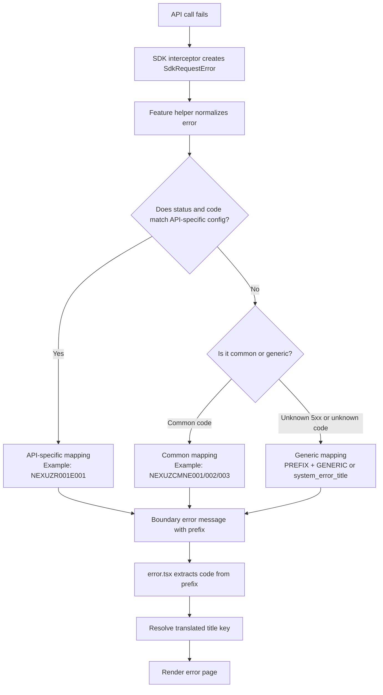

# Top App API Error Handling

## Scope

This document explains:

- where the auth-token API error is handled
- how API errors are generally handled in top-app

## Quick mapping diagram

Simple rule:

- API-specific match first
- then common error codes
- otherwise generic fallback

## 1) Auth-token API error handling (specific)

### Error catalog and mapping helpers

Auth-token error codes are defined and mapped in:

- `apps/top-app/modules/utils/helpers/auth-token/auth-token-utils.ts`

Key behavior in that file:

- Uses prefix `AUTH_TOKEN_API_ERROR:` for boundary errors.
- Includes endpoint-specific code `NEXUZR001E001` (HTTP 422).
- Merges shared common codes from `COMMON_ERROR_CONFIG`.
- Provides helpers to:
  - normalize thrown API errors (`getAuthTokenApiError`)
  - convert code to boundary error (`getAuthTokenBoundaryErrorFromCode`)
  - extract code from boundary error (`getAuthTokenErrorCodeFromBoundaryError`)
  - resolve translated title keys (`getAuthTokenErrorTitleKey`)

### Where this is consumed in page flow

In flight search page:

- `apps/top-app/app/[locale]/flight-search/page.tsx`

Flow:

1. Reads `tokenError` from `searchParams`.
2. Calls `getAuthTokenBoundaryErrorFromCode(tokenError)`.
3. Throws boundary error so Next.js error boundary handles rendering.

### Where UI title is resolved

In localized error boundary page:

- `apps/top-app/app/[locale]/error.tsx`

Flow:

1. `getAuthTokenErrorCodeFromBoundaryError(error)` tries to parse prefixed message.
2. If code is known, `getAuthTokenErrorTitleKey(code)` is used.
3. Falls back to `system_error_title` when code is unknown/missing.

### Middleware token fetch failure behavior

In middleware:

- `apps/top-app/proxy.ts`

When token creation via `coreApi.authTokenPost(...)` fails, middleware redirects to localized flight-search route.
This path does not currently append `tokenError` query param, so it uses redirect behavior instead of boundary-code rendering.

## 2) General API error handling pattern (top-app)

Most top-app API error handling follows a shared 5-step pattern.

### Step A: Transport layer throws normalized SDK error

File:

- `packages/sdk/sdk-client.ts`

`createSdkErrorInterceptor()` converts:

- non-2xx responses
- network/transport failures

into `SdkRequestError` with `status`, `method`, `url`, and `responseBody`.

### Step B: Feature helper normalizes unknown errors

File:

- `packages/sdk/error/parsing.ts`

`getSdkApiError(...)` converts unknown errors to a stable shape:

- `status`
- optional `code`
- optional `description`
- safe `message`

It parses backend `responseBody` JSON when available.

### Step C: Feature helper maps to boundary error

Files:

- `packages/sdk/error/boundary.ts`
- feature helper files under `apps/top-app/modules/utils/helpers/*`

Mapping functions:

- `getBoundaryErrorFromStatusCode(...)` for runtime errors
- `getBoundaryErrorFromCode(...)` for known code string input

Rules:

- matched status+code => specific boundary code
- unknown 5xx => `PREFIX + GENERIC`
- unsupported/unknown input code => generic code path (for code-based mapping)

### Step D: Error boundary decodes and resolves i18n title key

Files:

- `packages/sdk/error/title-key.ts`
- `apps/top-app/app/[locale]/error.tsx`

`resolveErrorTitleKey(...)` and feature wrappers map code to translation key, fallbacking to `system_error_title`.

### Step E: Shared common catalog is reused across APIs

File:

- `packages/sdk/error/catalog.ts`

`COMMON_ERROR_CONFIG` centralizes common codes (for example CMN codes), and feature configs extend it.

## 3) Other feature implementations following the same pattern

- `apps/top-app/modules/utils/helpers/airport-routes/airport-routes-utils.ts`
- `apps/top-app/modules/utils/helpers/calendar-fare/calendar-fare-utils.ts`

Both reuse shared SDK error utilities and common catalog exactly like auth-token helper.
