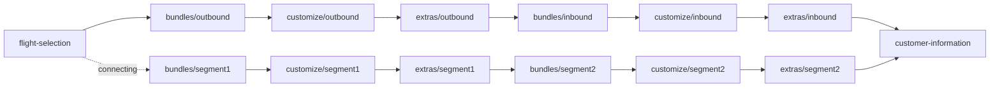

# Booking Flow Routing

This note explains how the `ibe-app` booking flow decides the next route after flight selection and how each trip type moves through the split pages.

## Source of truth

- Route sequencing lives in [apps/ibe-app/modules/utils/helpers/common/flow-router/flow-router.ts](apps/ibe-app/modules/utils/helpers/common/flow-router/flow-router.ts).
- Page-level `Proceed` actions call the helper from bundles, customize, and extras.
- The booking stepper reads the current nested route and maps it to a major step.

## Route naming

The flow uses nested routes instead of dashed route names:

- `bundles/outbound`
- `bundles/inbound`
- `bundles/segment1`
- `bundles/segment2`
- `customize/outbound`
- `customize/inbound`
- `customize/segment1`
- `customize/segment2`
- `extras/outbound`
- `extras/inbound`
- `extras/segment1`
- `extras/segment2`

At runtime these resolve under the locale segment, for example:

- `/en/bundles/outbound`
- `/en/customize/inbound`
- `/en/extras/segment2`

Route pages use a bracket segment per section (`[stage]`) to differentiate stage names the same way `[locale]` is used for locale.

## How flow type is detected

- `oneway` comes directly from the confirmed flight store when there is a single outbound segment.
- `roundtrip` comes directly from the confirmed flight store when an inbound journey exists.
- `connecting` is inferred when the confirmed outbound contains more than one segment.

## Flow matrix

### Oneway

Used for direct one-way itineraries.

```text
flight-selection
-> bundles/outbound
-> customize/outbound
-> extras/outbound
-> customer-information
```

### Roundtrip

Used when the booking has separate outbound and inbound journeys.

```text
flight-selection
-> bundles/outbound
-> customize/outbound
-> extras/outbound
-> bundles/inbound
-> customize/inbound
-> extras/inbound
-> customer-information
```

### Connecting

Used when the outbound contains more than one flight segment.

Connecting uses segment-specific route names:

```text
flight-selection
-> bundles/segment1
-> customize/segment1
-> extras/segment1
-> bundles/segment2
-> customize/segment2
-> extras/segment2
-> customer-information
```

UI labels are aligned with these route names:

- `segment1` is shown as `Segment 1`
- `segment2` is shown as `Segment 2`

## Sequence diagram



## Decision points in code

- `getBookingFlowType` derives `oneway`, `roundtrip`, or `connecting` from the confirmed flight payload.
- `getNextBookingFlowRoute` looks up the next step from the configured sequence.
- `getNextBookingFlowPath` builds the locale-prefixed URL used by navigation handlers.
- `getBookingDirectionLabel` converts internal `outbound` and `inbound` directions into labels, including `Segment 1` and `Segment 2` for connecting itineraries.
- `getBookingStageSegment` resolves direction to route stage names (`outbound/inbound` vs `segment1/segment2`).
- `getBookingDirectionFromStage` maps stage route params back to direction for dynamic `[stage]` pages.

## Stepper behavior

The booking stepper keeps the same major steps and only changes how nested routes are recognized:

- `bundles/outbound` and `bundles/inbound` map to the bundle step.
- `bundles/segment1` and `bundles/segment2` also map to the bundle step.
- `customize/outbound` and `customize/inbound` map to the customize step.
- `customize/segment1` and `customize/segment2` also map to the customize step.
- `extras/outbound` and `extras/inbound` map to the extras step.
- `extras/segment1` and `extras/segment2` also map to the extras step.

## Why connecting still reuses outbound/inbound direction in components

Connecting data is still represented as a multi-segment outbound selection in the store. Components therefore keep the same logical direction contract (`outbound` and `inbound`) for state and labels, while route-level stage names switch to `segment1` and `segment2` for clearer URLs.