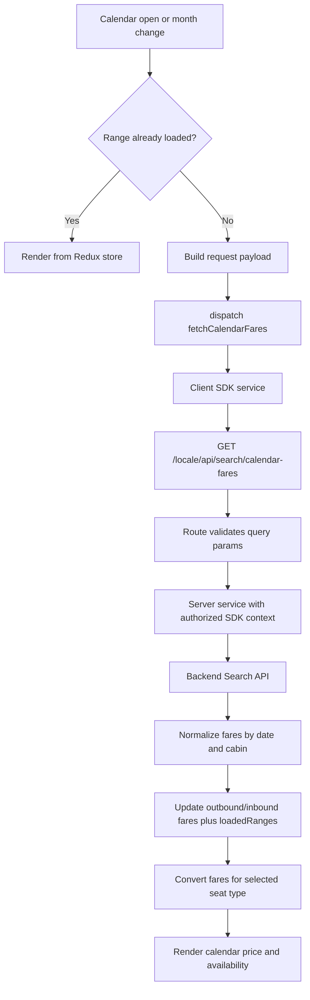

# Calendar Fares API Flow (Top App)

## Goal
Explain how calendar fare data is requested, validated, fetched, transformed, stored, and rendered in the calendar UI.

## Short verdict (best practice)

Current flow is mostly best practice.

- Good separation: UI -> state -> service -> API route -> backend SDK.
- Good protection: duplicate request guard, in-flight lock, stale response check.
- Good UX: incremental loading by visible range and local cache via loadedRanges.

## Diagram-first flow

## Short flow summary

1. Check if visible dates are already covered.
2. If missing, request next range.
3. Validate and proxy through localized API route.
4. Call backend with security token.
5. Normalize and store fares.
6. Render filtered prices in calendar.

## End-to-end flow

1. Calendar modal opens and decides whether data is needed.
2. UI builds request payload and dispatches Redux thunk.
3. Thunk calls client-side SDK wrapper.
4. SDK wrapper calls Next.js route under localized API path.
5. Route validates query params and calls server service.
6. Server service calls backend via authorized SDK client.
7. Response returns to thunk.
8. Redux slice normalizes and stores outbound/inbound fares by date.
9. UI maps fare data to display prices and updates calendar grid.

## Sequence details

### 1) UI trigger and range strategy
File: apps/top-app/components/flight-search/calendar/CalendarContent.tsx

- Initial fetch happens in useEffect when:
	- Calendar is open.
	- Origin and destination are available.
	- Visible range is not already covered by loadedRanges.
- Range is fetched in 90-day chunks using getNext90DayRange.
- Lazy loading is triggered by onVisibleMonthChange when user navigates months.
- Fetch ceiling is capped to today + 364 days.

### 2) Request payload construction
File: apps/top-app/components/flight-search/calendar/CalendarContent.tsx
File: apps/top-app/components/flight-search/helper/helper.ts

- buildSearchRoutes creates routes:
	- Round-trip: ORIGIN,DESTINATION
	- One-way non-NRT route: ORIGIN,NRT,DESTINATION (connect via NRT)
- Request payload fields:
	- routes
	- departureDateFrom (range start)
	- departureDateTo (next day of from date for round-trip)
	- language (locale)
	- currency (JPY)
	- promotionCode (optional)

### 3) Duplicate and concurrency guards
File: apps/top-app/components/flight-search/calendar/CalendarContent.tsx
File: apps/top-app/store/slices/calendar-fares.slice.ts

- isFetchingRef prevents overlapping dispatches from rapid UI updates.
- isSameCalendarRequest blocks repeated request payloads when the latest request already matches and no error exists.
- Slice also re-checks request identity on fulfilled/rejected to ignore stale async responses.

### 4) Redux async thunk call
File: apps/top-app/store/slices/calendar-fares.slice.ts

- fetchCalendarFares thunk receives:
	- locale
	- request
	- loadedRange
- Thunk calls searchCalendarFaresGetBySdk(locale, request).
- Pending state sets:
	- request snapshot
	- isPending true
	- clears error

### 5) Client-side SDK wrapper
File: apps/top-app/modules/services/calendar-fares-sdk.service.ts

- Creates localized base URL:
	- Browser: window origin + /{locale}/api
	- Fallback: /{locale}/api
- Builds SDK context with createSdkClientContext.
- Calls SearchApi.searchCalendarFaresGet(params, { cache: no-store }).

This means the browser request goes to the app route:
GET /{locale}/api/search/calendar-fares

### 6) Next.js API route validation and mapping
File: apps/top-app/app/[locale]/api/search/calendar-fares/route.ts

- Validates required query parameters:
	- routes
	- departureDateFrom
	- language
	- currency
- Returns 400 if any required value is missing.
- Builds SearchCalendarFaresGetRequest.
- Promo mapping supports both query names:
	- promoCode
	- promotionCode
- Calls fetchCalendarFares(params) in server service.

### 7) Server-side authorized backend call
File: apps/top-app/modules/services/calendar-fares.service.ts
File: apps/top-app/modules/services/auth-token.service.ts
File: packages/sdk/sdk-client.ts

- fetchCalendarFares gets an authorized SDK context using getAuthorizedSdkClientContextForRequest.
- Authorization token comes from cookie ibe_security_token.
- SDK configuration injects header x-security-token.
- Backend base URL comes from BACKEND_API_BASE_URL.
- SDK middleware throws structured SdkRequestError for non-2xx/network failures.

### 8) Redux normalization and state update
File: apps/top-app/store/slices/calendar-fares.slice.ts

- Response shape expected:
	- data.outbound[]
	- data.inbound[] (optional)
- For each entry:
	- normalize date key to YYYY-MM-DD.
	- map cabin:
		- STANDARD -> standard
		- ZIPFULLFLAT -> zipFullFlat
	- store lowestPrice under outboundFares or inboundFares.
- loadedRange is appended after successful response.
- On error, error message is set and isPending is cleared.

### 9) UI display conversion
File: apps/top-app/lib/calendar-fare-utils.ts
File: apps/top-app/components/flight-search/calendar/CalendarContent.tsx

- convertFaresToPrices filters fares by selected seat type:
	- standard
	- zip
- Only dates that contain selected fare type are included.
- Missing date/type displays as unavailable in calendar.
- Calendar loading state:
	- true while pending, or
	- true when open with no loaded ranges and no error.

## Key methods by file

### Calendar UI
File: apps/top-app/components/flight-search/calendar/CalendarContent.tsx

- requestCalendarFares(rangeToFetch)
	- Builds payload, applies duplicate guard, dispatches thunk.
- useEffect initial loader
	- Loads first 90 days when needed.
- handleVisibleMonthChange(visibleMonth, secondVisibleMonth)
	- Triggers lazy-load for uncovered month ranges.

### Route builder helper
File: apps/top-app/components/flight-search/helper/helper.ts

- buildSearchRoutes(origin, destination, tripType)
	- Produces route string for direct or NRT-connecting search.

### Calendar slice
File: apps/top-app/store/slices/calendar-fares.slice.ts

- fetchCalendarFares thunk
- isSameCalendarRequest(left, right)
- normalizeFareDateKey(rawDate)
- resetCalendarFares reducer
- addLoadedRange reducer

### Calendar SDK service (client)
File: apps/top-app/modules/services/calendar-fares-sdk.service.ts

- searchCalendarFaresGetBySdk(locale, params)

### Calendar service (server)
File: apps/top-app/modules/services/calendar-fares.service.ts

- fetchCalendarFares(params)

### API route
File: apps/top-app/app/[locale]/api/search/calendar-fares/route.ts

- GET(request)

### Auth and SDK infra
File: apps/top-app/modules/services/auth-token.service.ts
File: packages/sdk/sdk-client.ts

- getAuthorizedSdkClientContextForRequest()
- requireSecurityToken()
- createAuthorizedSdkClientContext()
- createAuthorizedSdkConfiguration()

## Practical note about the selected dispatch block

In CalendarContent, this dispatch block is intentionally wrapped with:

- isFetchingRef guard before dispatch.
- catch(() => undefined) to swallow promise rejection at callsite.
- finally to reliably release isFetchingRef lock.

So the thunk lifecycle still updates Redux error state, while UI avoids duplicate in-flight requests.

## Global error handling (interceptor)

### Current interceptor coverage in this project

- SDK global interceptor already exists in packages/sdk/sdk-client.ts via createSdkErrorInterceptor().
- It converts non-2xx and network failures into SdkRequestError with status, method, URL, and response body.
- Axios global interceptor also exists for axios clients in apps/top-app/api-client/axios.ts via applyApiErrorInterceptor().

### Recommended global error strategy

Use two layers:

1. Transport layer normalization (global interceptor)
2. Feature layer mapping (thunk or route)

Transport layer should produce a consistent error object.
Feature layer should map that to user-facing text and logging fields.

### How to handle it in this calendar flow

1. Keep SDK interceptor as the single global transport error source.
2. In thunk catch, map SdkRequestError status to domain messages.
3. In route catch, keep getApiErrorMessage as final server response sanitizer.
4. In UI, read slice error and show one consistent message component.

### Example status mapping for thunk catch

- 400: Invalid search criteria.
- 401 or 403: Session/token issue.
- 404: No fare data for requested range.
- 429: Too many requests, retry shortly.
- 500+: Temporary server issue.

### Minimal pattern for your selected catch block

In apps/top-app/store/slices/calendar-fares.slice.ts, the catch block can keep rejectWithValue, but map known error types first:

- If error is SdkRequestError and has status, map by status.
- Else fallback to generic unable-to-fetch message.

This keeps global handling centralized while preserving feature-specific UX.

