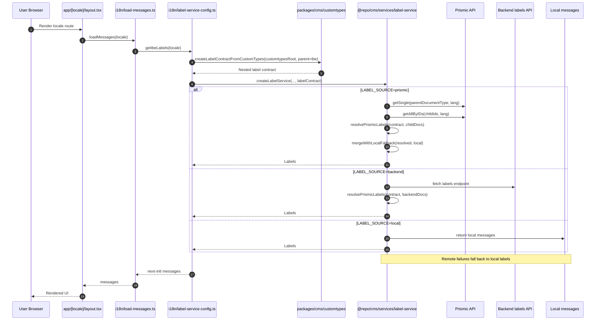

# Prismic Label Flow

This is the canonical reference for the label flow in this repository.
It combines the runtime translation flow, Prismic contract generation, model
generation, and migration guidance into one document.

## Source of Truth

This section defines ownership boundaries for the label system.

- Local message files define the content shape and the initial label values.
- Prismic custom type models define the runtime label contract.
- Runtime labels may come from Prismic, backend, or local sources.
- The runtime contract must always be generated from Prismic custom type
  metadata, not locale JSON.

## Terminology

- Source shape: the nested label structure defined in local message files.
- Document registry: the mapping that turns message containers into Prismic
  label documents.
- Model structure: the generated custom type layout under
  `packages/cms/customtypes`.
- Runtime contract: the nested object used by the app to resolve labels at
  runtime.

## What the flow does

The label pipeline has three stages, with clear ownership at each step:

1. Local labels define the source shape and initial values in
   `apps/ibe-app/messages/en.json` and `apps/ibe-app/messages/ja.json`.
2. Prismic custom type metadata defines the model structure and the runtime
   contract under `packages/cms/customtypes`.
3. The app runtime resolves labels from Prismic, backend, or local fallback and
   turns them into `next-intl` messages.

## Runtime flow

The app wiring in [apps/ibe-app/i18n/label-service-config.ts](apps/ibe-app/i18n/label-service-config.ts)
creates the label contract once from custom types and then exposes
`getIbeLabels()` to the app.

`loadMessages()` in [apps/ibe-app/i18n/load-messages.ts](apps/ibe-app/i18n/load-messages.ts)
delegates directly to that label service.

At runtime:

1. `label-service-config.ts` calls `createLabelContractFromCustomTypes()` from
   `@repo/cms/prismic`.
2. `createLabelService()` from `@repo/cms/services/label-service` is initialized
   with the app locale list, local fallback messages, and the generated label
   contract.
3. `getLabels(locale)` resolves the configured source:
   - `LABEL_SOURCE=prismic` loads from Prismic
   - `LABEL_SOURCE=backend` loads from the backend label endpoint
   - anything else falls back to local messages
4. Prismic and backend payloads are mapped back into the nested app contract
   with `resolvePrismicLabels()`.
5. If a remote source fails, the service falls back to local messages.

## Label Source Resolution

`createLabelService()` resolves labels in three modes:

- `LABEL_SOURCE=prismic` loads from Prismic and falls back to local messages if
   the remote fetch fails.
- `LABEL_SOURCE=backend` loads from the backend labels API and falls back to
   local messages if the remote fetch fails.
- `LABEL_SOURCE=local` or any other value uses local messages only.

## Contract generation from custom types

The authoritative implementation lives in
[packages/cms/src/prismic/label-contract.ts](packages/cms/src/prismic/label-contract.ts).

`createLabelContractFromCustomTypes()` reads every model under the configured
custom types root, then builds the runtime contract from model metadata.

Contracts come from custom types rather than locale JSON because custom types
encode the structural rules that the runtime must honor: tabs, nested groups,
and linked documents are already normalized there, while locale JSON is only the
source shape and content source during migration.

Key behavior:

- The parent document type is `ibe` in this repo.
- If `ibe` contains linked document types in `Main`, those links are the
   authoritative runtime contract document list.
- If linked document types do not exist, the contract falls back to every model
   except the parent document type.
- Tabs map to nested namespaces using `tabNameToNamespace()`.
- `Group` fields become object or array templates depending on `repeat`.
- Link fields are ignored in the label contract.

Use `createLabelContractFromCustomTypes()` from `@repo/cms/prismic`; do not
rebuild the contract from locale JSON shape.

## Document registry

The registry in [packages/cms/src/prismic/document-registry.ts](packages/cms/src/prismic/document-registry.ts)
defines which local messages become Prismic documents.

Current behavior:

- If `messages.documents` exists and is a record, it is treated as the document
  container.
- Otherwise, the root messages object is treated as the container.
- Each top-level record becomes one Prismic label document.

This means the registry owns document identity, while the app owns the local
message content until Prismic is the source of truth.

## End-to-End Example

Local source shape:

```json
{
   "passenger": {
      "first_name": "First name",
      "personal_info": {
         "middle_name": "Middle name"
      }
   }
}
```

Prismic document result:

- `Main`
   - `First Name` -> `Text`
- `Personal Info` tab
   - `Middle Name` -> `Text`

Runtime contract mapping:

```ts
{
   passenger: {
      first_name: "",
      personal_info: {
         middle_name: ""
      }
   }
}
```

This example shows the full handoff: local messages provide the shape, the
registry turns that shape into a document, custom types define the runtime
contract, and the runtime fills the contract from the selected label source.

## Model generation rules

The generator that produces `packages/cms/customtypes/*/index.json` uses the
document registry shape as its input.

Practical rules:

- root-level simple fields stay in `Main`
- nested objects create tabs
- arrays of objects become `Group` fields
- `title`, `subtitle`, and `description` are treated as `StructuredText`
  unless they are under `seo.*`
- arrays of strings are not a supported group shape
- empty arrays are not enough to infer group structure

The relevant command is:

```bash
# Generate all models (original behavior)
pnpm prismic:models:generate -- --source ibe-app

# Generate single custom type
pnpm prismic:models:generate -- --source ibe-app --document common

# Error example (document not found)
$ pnpm prismic:models:generate -- --source ibe-app --document nonexistent
Error: Document "nonexistent" not found. Available documents: common, hotel, flight, ...
```

Validation:

```bash
pnpm prismic:validate
pnpm prismic:check
```

If the structure changed, regenerate types:

```bash
pnpm prismic:types:generate
```

## Migration and sync workflow

Ownership:

- IBE app team owns `apps/ibe-app/messages/en.json`, `apps/ibe-app/messages/ja.json`,
  and app UI label usage.
- Prismic team owns `packages/cms/src/prismic/document-registry.ts`,
  `packages/cms/customtypes`, `packages/cms/scripts`, Slice Machine sync, and
  content migration.

Recommended flow:

1. Update `apps/ibe-app/messages/en.json` and `apps/ibe-app/messages/ja.json`.
2. Verify the message shape is discoverable by the registry.
3. Run `pnpm prismic:models:generate -- --source ibe-app`.
4. Run `pnpm prismic:validate`.
5. If the model structure changed, run `pnpm prismic:types:generate`.
6. Sync the custom types with Slice Machine using `pnpm dev:prismic` and
   `pnpm slicemachine`.
7. Preview content migration with `pnpm prismic:seed:dry -- --source ibe-app`.
8. Run content migration with `pnpm prismic:seed -- --source ibe-app`.

Locale-specific migration:

```bash
pnpm prismic:seed:dry -- --source ibe-app --locale en
pnpm prismic:seed:dry -- --source ibe-app --locale ja
pnpm prismic:seed -- --source ibe-app --locale en
pnpm prismic:seed -- --source ibe-app --locale ja
```

Single document migration (dry-run and write):

```bash
# Process one document (dry-run)
pnpm prismic:content:seed -- --source ibe-app --document common

# Process one document and write to Prismic
pnpm prismic:content:seed -- --source ibe-app --document common --write

# Process one document with locale override
pnpm prismic:content:seed -- --source ibe-app --document common --locale ja --write

# Error example (document not found)
$ pnpm prismic:content:seed -- --source ibe-app --document nonexistent
Error: Document "nonexistent" not found. Available documents: common, hotel, flight, ...
```

## Runtime diagram



## Key Takeaways

- The runtime contract comes from custom types.
- Document identity comes from the registry.
- Content originates in local messages during migration.
- Runtime can resolve labels from multiple sources with local fallback.

## Summary

If you need the current flow in one place, start here.
The main implementation anchors are:

- [packages/cms/src/prismic/label-contract.ts](packages/cms/src/prismic/label-contract.ts)
- [packages/cms/src/services/label-service.ts](packages/cms/src/services/label-service.ts)
- [packages/cms/src/prismic/document-registry.ts](packages/cms/src/prismic/document-registry.ts)
- [apps/ibe-app/i18n/label-service-config.ts](apps/ibe-app/i18n/label-service-config.ts)
