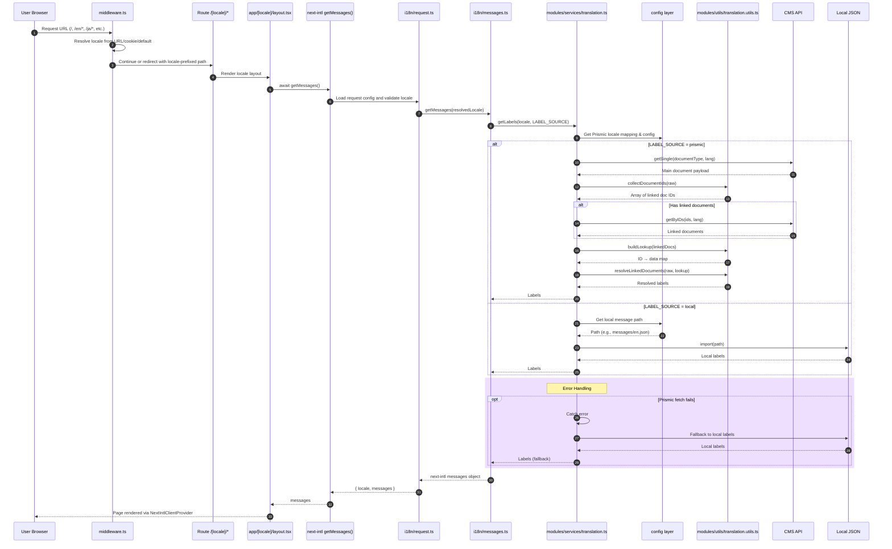

# IBE Translation Flow

## Purpose
This document explains the enterprise-grade translation system for IBE, including locale routing, next-intl integration, multi-source label resolution, and error handling with graceful fallback strategies.

## Architecture Overview

### Layers
- **Config Layer**: Centralized configuration, locale mappings, and environment settings
- **Utils Layer** (`modules/utils/translation.utils.ts`): Reusable utility functions for type checking and data processing
- **Service Layer** (`modules/services/translation.ts`): Translation service with caching and fallback strategies
- **Integration Layer** (`i18n/messages.ts`, `i18n/request.ts`): next-intl integration

## Main Runtime Flow



## Configuration

### Supported Locales
```typescript
locales = ["en", "ja", "zh-cn", "zh-tw", "ko", "th"]
defaultLocale = "en"
```

### Locale Prismic Mapping
| App Locale | Prismic Code |
|-----------|--------------|
| en        | en-us        |
| ja        | ja-jp        |
| ko        | ko-kr        |
| th        | th           |
| zh-cn     | zh-cn        |
| zh-tw     | zh-tw        |

### Environment Variables

| Variable | Default | Purpose |
|----------|---------|---------|
| `LABEL_SOURCE` | `local` | Source for labels: `local` \| `prismic` \| `backend` |
| `IBE_PRISMIC_DOCUMENT_TYPE` | `ibe` | Prismic document type for IBE labels |
| `IBE_DEBUG_LABEL_FLOW` | `false` | Enable debug logging for translation flow |
| `IBE_DEBUG_PRISMIC_LINKS` | `false` | Log missing Prismic linked documents |

## File Structure

```
modules/
├── config/
│   └── translation.config.ts      # Locale mappings, config constants
├── services/
│   └── translation.ts              # Core translation service with caching
└── utils/
    └── translation.utils.ts        # Utility functions: type guards, helpers

i18n/
├── messages.ts                     # next-intl integration
└── request.ts                      # Request config with locale validation

types/
└── translation.ts                  # Type definitions: TopLabels, Prismic types

messages/
├── en.json                         # English labels
├── ja.json                         # Japanese labels
├── ko.json                         # Korean labels
├── th.json                         # Thai labels
├── zh-cn.json                      # Simplified Chinese labels
└── zh-tw.json                      # Traditional Chinese labels
```

## Error Handling & Resilience

### Prismic Failure Handling
If Prismic fetch fails (network error, timeout, missing document):
1. Service logs the error with context
2. Automatically falls back to local JSON labels
3. User sees labels (no broken UI)
4. No service disruption

### Invalid Locale Handling
1. Locale validation in `i18n/request.ts`
2. Falls back to `defaultLocale` if invalid
3. Ensures consistent behavior across routes

## Performance Optimizations

1. **React Server Caching** (`cache()` from 'react')
   - Deduplicates requests within same render pass
   - Reduces redundant Prismic calls

2. **Lazy Imports** 
   - Local messages imported on-demand by locale
   - Reduces initial bundle size

3. **Efficient Link Resolution**
   - Single pass through document data
   - Set-based deduplication of document IDs
   - Minimizes API calls

## Development & Debugging

### Enable Debug Logging
```bash
# Terminal
export IBE_DEBUG_LABEL_FLOW=true
export IBE_DEBUG_PRISMIC_LINKS=true
pnpm dev
```

### Monitor Log Output
```
[TranslationService] getLabels called { locale: 'en', source: 'prismic' }
[TranslationService] Fetching Prismic labels { locale: 'en', prismicLocale: 'en-us' }
[TranslationService] Found 3 linked documents to resolve
[TranslationService] Missing linked Prismic document for key "common" ...
```

### Testing Translation Service
```typescript
import { translationService } from '@/modules/services/translation';

// Get labels from Prismic
const labels = await translationService.getLabels('en', 'prismic');

// Get labels from local fallback
const localLabels = await translationService.getLabels('ja', 'local');
```

## Future Enhancements

- **Backend Source**: Implement `LABEL_SOURCE=backend` for API-driven labels
- **Cache Invalidation**: Webhook-based cache refresh for Prismic updates
- **CDN Integration**: Cache Prismic responses in edge network
- **A/B Testing**: Label variant selection by user segment
- **Real-time Updates**: WebSocket support for live label changes